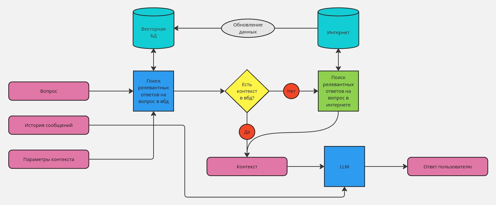
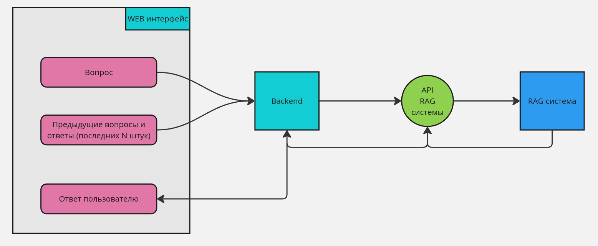
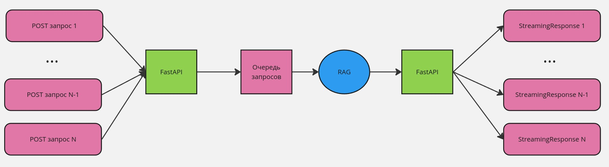
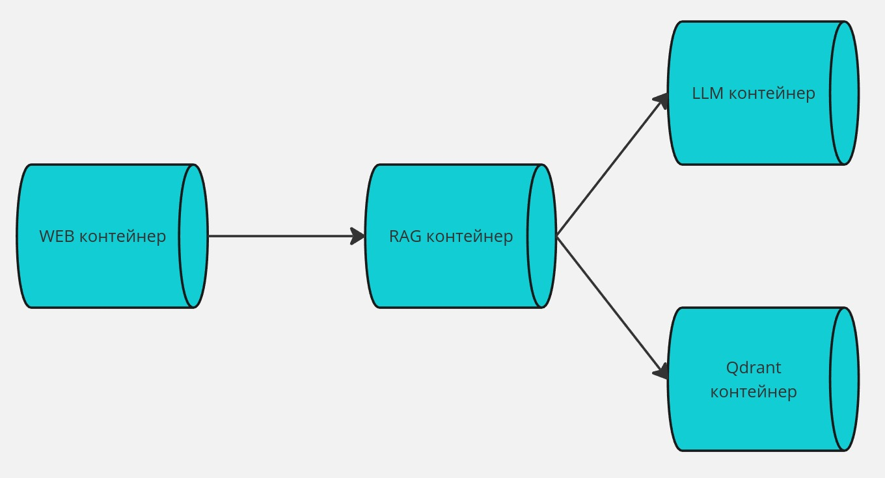
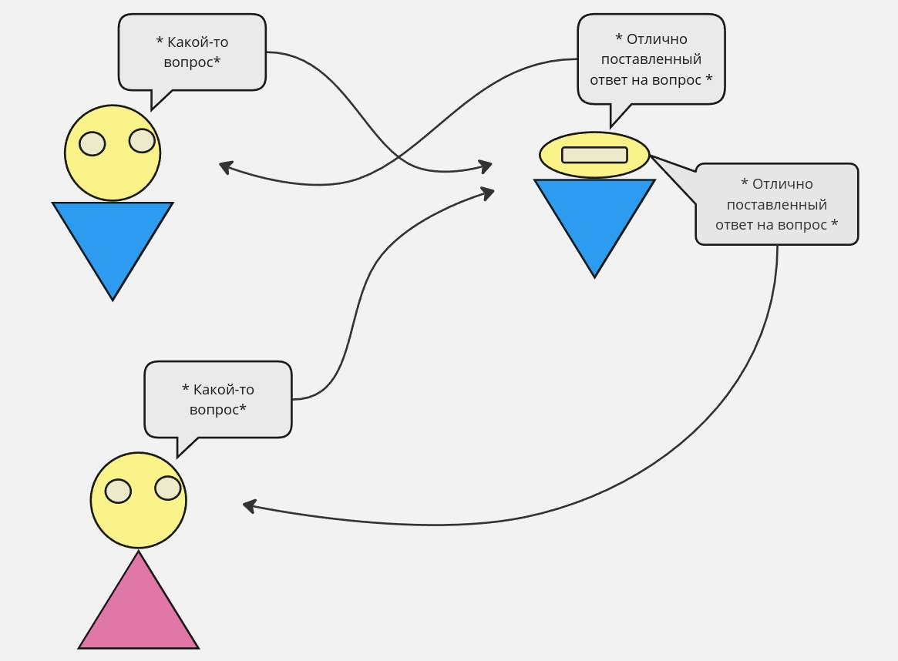
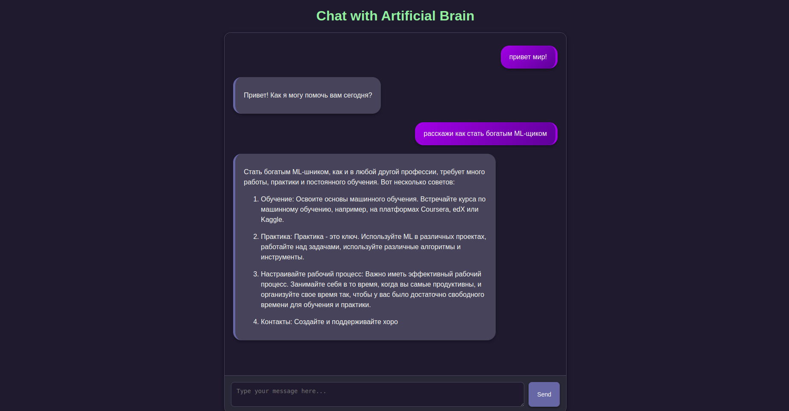
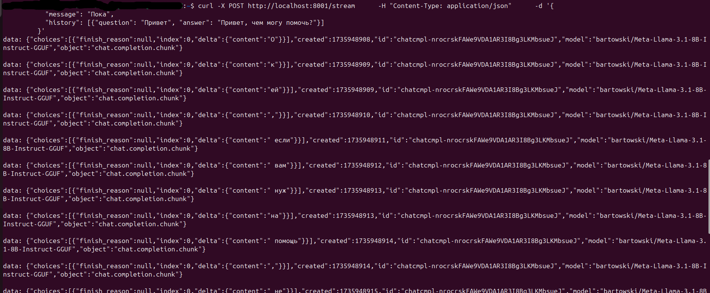
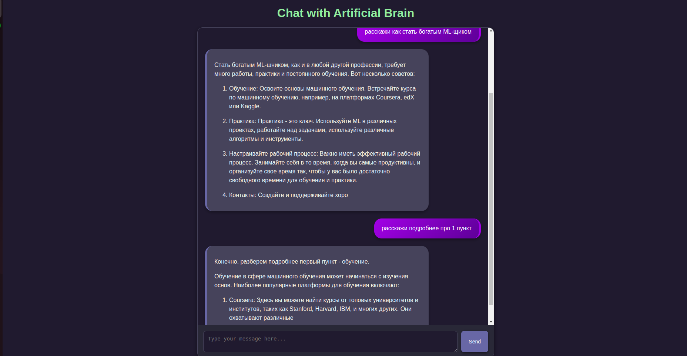
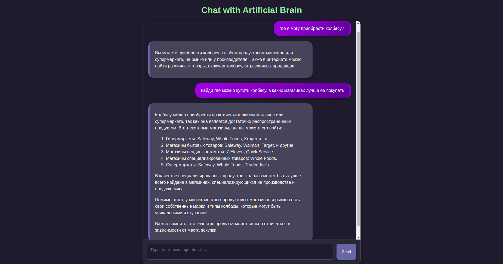
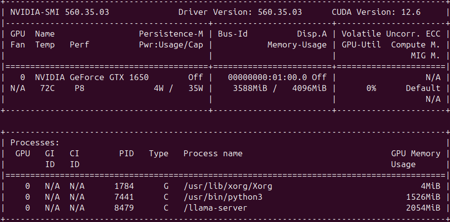

# Artificial Brain

## Описание

Этот проект представляет собой систему взаимодействия с ботом через веб-интерфейс, использующую RAG (Retrieval-Augmented Generation) модель для обработки запросов пользователей. Проект состоит из трёх основных частей:

- **LLM**: Каталог с весовыми файлами модели LLM.
- **RAG_API**: Каталог, где расположены структура RAG-системы, FastAPI для взаимодействия с моделью и Docker-сборки.
- **WEB**: Каталог с веб-интерфейсом для общения с ботом и Docker-сборкой.

## Установка

Для установки проекта вам понадобится следующее:

- Python 3.12+
- nvcc 12.6+
- Docker
- Docker Compose
- nvidia-container-toolkit
- nvidia-docker
- `опционально` ngrok

### Шаги установки

1. Клонируйте репозиторий:
   ```bash
   git clone https://github.com/CHISH08/RAG_System.git
   ```

2. Перейдите в директорию проекта:
   ```bash
   cd RAG_System
   ```

3. Создайте docker сеть для взаимодействия модулей:
   ```bash
   docker network create rag_network
   ```

4. Запустите с помощью docker run ollama.cpp и укажите предварительно установленную модель с huggingface:
   ```bash
   docker run --name llm -d --gpus all   -v ./LLM:/models   --network rag_network   ghcr.io/ggerganov/llama.cpp:server-cuda   -m /models/Qwen2.5-Coder-14B-Instruct-IQ2_XS.gguf   --port 8000   --host 0.0.0.0   --n-gpu-layers 12
   ```
   [Пояснение по параметрам и запуску читайте в данном репозитории](https://github.com/ggerganov/llama.cpp)

5. Перейдите в папку RAG_api и запустите Docker Compose для сборки и запуска api раг ситсемы:
   ```bash
   cd RAG_api
   docker-compose up -d --build
   ```

6. Перейдите в папку WEB и запустите веб интерфейс для работы с api модели:
   ```bash
   cd ../WEB
   docker-compose up -d --build
   ```

7. После завершения сборки и запуска вы можете открыть веб-интерфейс по адресу `http://localhost:8002`.

8. *Опционально:* Чтобы вывести свой сайт глобально в интернет, можно воспользоваться инструментом ngrok. Для этого выполните команду:

   ```bash
   ngrok http 8002
   ```

   Это создаст публичный URL, через который ваш сайт будет доступен в интернете.

## Использование

### Веб-интерфейс

Веб-интерфейс позволяет пользователям взаимодействовать с ботом посредством чата. Для начала работы просто откройте [веб-интерфейс](http://localhost:8002) и начните вводить запросы.

### API

API предоставляет доступ к функциональности RAG-модели. Вы можете отправлять POST-запросы на адрес `http://localhost:8001/stream` со следующим телом JSON:

```json
{
  "message": "Пока",
  "history": [{"question": "Привет", "answer": "Привет, чем могу помочь?"}]
}
```

Ответ будет содержать предсказание от модели.

Пример отправки POST-запроса через терминал с использованием `curl`:

```bash
curl -X POST http://localhost:8001/stream      -H "Content-Type: application/json"      -d '{
           "message": "Пока",
           "history": [{"question": "Привет", "answer": "Привет, чем могу помочь?"}]
         }'
```

Этот запрос отправит JSON с параметром `query` на сервер, и вы получите ответ от модели в терминале.

## Структура проекта

- **LLM**:
  - Каталог, предназначенный для хранения весовых файлов модели LLM.

- **RAG_API**:
  - `api/` подкаталог:
    - `app.py`: Основной файл приложения FastAPI.
    - `model/` подкаталог:
      - `components/` подкаталог:
        - `__init__.py`: Инициализация компоненты.
        - `llm/` подкаталог:
          - `__init__.py`: Инициализация модели LLM.
          - `search.py`: Компонент поиска.
          - `summarizer.py`: Компонент суммирования.
          - `vbd.py`: Компонент вывода.
      - `__init__.py`: Инициализация модели.
      - `model.py`: Основной файл модели.
      - `sentence_transformer_cache`: Файл кеширования модели эмбеддера.
    - `docker-compose.yaml`: Файл конфигурации Docker для сборки контейнера.
    - `Dockerfile`: Файл конфигурации Docker для сборки контейнера.
    - `requirements.txt`: Список зависимостей проекта.
    - `notebook/` подкаталог: Файлы Jupyter Notebook для теста модулей.

- **WEB**:
  - `app.py`: Основной файл приложения Flask.
  - `docker-compose.yaml`: Файл конфигурации Docker для сборки контейнера.
  - `Dockerfile`: Файл конфигурации Docker для сборки контейнера.
  - `requirements.txt`: Список зависимостей проекта.
  - `static/` подкаталог:
    - `script.js`: Основной скрипт JavaScript.
    - `style.css`: Основной CSS файл.
  - `templates/` подкаталог:
    - `index.html`: Главный HTML шаблон.

## Архитектура RAG_api

### Архитектура RAG системы



### Архитектура WEB



### Архитектура api RAG системы



### Взаимодействие контейнеров
Взаимодействие выполняется с помощью общей сети в docker под названием rag_network



### Принцип работы



## Пример работы

### WEB интерфейс



### Request запрос



## Особенности модели

1) Запоминание контекста: модель способна запоминать предыдущие вопросы пользователя и ответы, которые она давала на них. Это позволяет модели лучше понимать, что от нее хочет пользователь.



2) Векторная база данных: модель имеет векторную базу данных, в которой хранятся данные, полученные при парсинге страниц в интернете. Это ускоряет работу модели, тк ей не всегда приходится искать релевантную информацию в интернете, а только в случаях, когда контекста нет. Также наличие базы данных уменьшает риск галюционирования модели.

3) Доступ в интернет: при отсутствии ответа на вопрос, модель обращается в интернет за помощью, чтобы получить свежий и релеватный контекст для ответа.



4) Использование ollama.cpp: ollama.cpp позволяет запускать LLM частично на гпу и частично на цпу. Таким образом можно регулировать скорость-память при ограниченной памяти гпу.

```bash
   docker run --name llm -d --gpus all   -v ./LLM:/models   --network rag_network   ghcr.io/ggerganov/llama.cpp:server-cuda   -m /models/Qwen2.5-Coder-14B-Instruct-IQ2_XS.gguf   --port 8000   --host 0.0.0.0   --n-gpu-layers 12
```

5) Использование instruct модели при всего 4 гб памяти гпу: llm потребляет всего 2 гб (при весе в 4 гб), остальные 2 гб расходуются на работу модели-эмбеддера.


